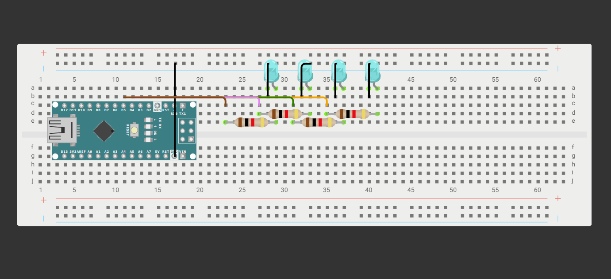

# Arduino binario con cuatro LEDs

Proyecto educativo de Arduino que utiliza cuatro LEDs para representar números
decimales en formato binario. El circuito cuenta del `0` al `15`, muestra cada
valor durante un segundo y luego reinicia la secuencia.



> [!IMPORTANT]
> El proyecto está pensado para aprender los fundamentos de Arduino, la
> representación binaria y el control de salidas digitales.

## Vista general

El circuito está formado por:

- Un Arduino Nano.
- Una protoboard.
- Cuatro LEDs de color cian.
- Cuatro resistencias de `1000 Ω` (`1 kΩ`), una por cada LED.
- Cables jumper para reproducir las conexiones del circuito.

Con cuatro bits se pueden representar `2^4 = 16` valores, desde `0000` (`0`)
hasta `1111` (`15`).

| LED | Pin del Arduino | Valor que representa |
|---|---:|---:|
| `bit1` | D2 | 1 |
| `bit2` | D3 | 2 |
| `bit3` | D4 | 4 |
| `bit4` | D5 | 8 |

El primer LED corresponde al bit menos significativo y el cuarto al bit más significativo.

## Simulación en Wokwi

No es necesario disponer de un Arduino físico para probar la simulación. El
circuito puede visualizarse y ejecutarse en Wokwi:

[Abrir el circuito en Wokwi](https://wokwi.com/projects/476822154201427969)

> [!NOTE]
> La simulación sirve como referencia visual del ensamblaje. Antes de realizar el montaje físico, comprueba la polaridad de los LEDs y todas las conexiones.

## Documentación

| Documento | Descripción |
|---|---|
| [Código Arduino](docs/codigo.ino) | Programa del circuito |
| [Código comentado](docs/codigoComentado.ino) | Versión del programa con comentarios |
| [Explicación del código](docs/codigo_explicado.md) | Explicación de variables, funciones y conversión binaria |
| [Guía de ensamblaje](docs/ensamblaje.md) | Materiales y consideraciones para el montaje físico |
| [JSON de Wokwi](docs/EnsambladoArduino.json) | Definición de componentes y conexiones de la simulación |

## Materiales

Para consultar la lista completa de materiales, cantidades y características,
revisa la [guía de ensamblaje](docs/ensamblaje.md).

Resumen:

| Cantidad | Material | Característica |
|---:|---|---|
| 1 | Arduino Nano | Placa compatible con el modelo de la simulación |
| 1 | Protoboard | Para realizar las conexiones |
| 4 | LED | Color cian |
| 4 | Resistencia | `1000 Ω` (`1 kΩ`) |
| 9 | Cable jumper | Cantidad mínima estimada a partir de las conexiones explícitas |

>[!NOTE]
> La cantidad y la longitud exacta de los cables pueden variar según la
> distribución física de la protoboard. Las conexiones internas de la
> protoboard no equivalen necesariamente a cables independientes.

## Código

El archivo principal es [`docs/codigo.ino`](docs/codigo.ino). Sus funciones
principales son:

- `setup()`: configura los pines conectados a los LEDs como salidas.
- `loop()`: convierte y muestra el valor actual, espera un segundo y avanza el
  contador.
- `convertirDecimalBinario()`: transforma el número decimal en cuatro bits.
- `encenderLeds()`: enciende o apaga cada LED según el bit correspondiente.

## Consideraciones importantes

- Cada LED debe utilizar una resistencia de `1000 Ω` para limitar la corriente.
- Respeta la polaridad de los LEDs: ánodo (`A`) y cátodo (`C`).
- Verifica que la referencia de tierra (`GND`) esté conectada correctamente.
- Comprueba que no exista un cortocircuito entre `5V` y `GND`.
- Revisa las conexiones antes de energizar el Arduino Nano.
- La fuente de alimentación exacta no está definida en el JSON; utiliza una
  fuente compatible con el modelo físico de tu Arduino Nano.

Para conocer más detalles, consulta las [consideraciones de montaje](docs/ensamblaje.md).

## Estructura del proyecto

```text
.
├── README.md
└── docs/
    ├── codigo.ino
    ├── codigoComentado.ino
    ├── codigo_explicado.md
    ├── ensamblaje.md
    └── EnsambladoArduino.json
```

## Objetivo educativo

Este proyecto permite practicar:

- Variables y constantes en Arduino.
- Funciones y prototipos.
- Arreglos de valores booleanos.
- Operaciones de división y residuo.
- Conversión de números decimales a binarios.
- Control de LEDs mediante `digitalWrite()`.
